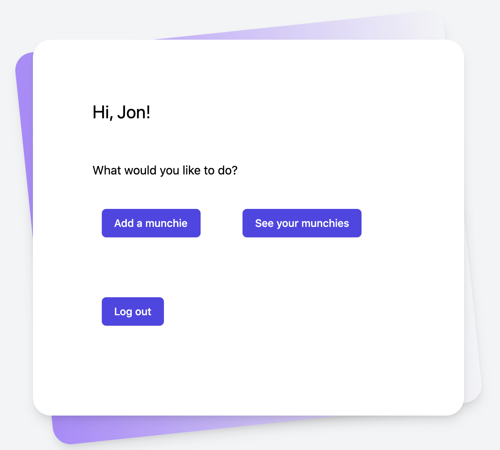

Media Munch 
============

An app for those of us who are obsessed with all forms of entertainment media. 

   

## [Live demo](https://media-munch.herokuapp.com/)

## Description
Are you a vociferous consumer of entertainment media? Would you like a way to keep track of everything you consume, whether it's a movie, tv show, game, or comic book? Meet Media Munch, an app that pulls from mulitple entertainment-related APIs to allow you to keep track of everything you've watched, read, or played . . . all in the same place. 

At Media Munch, you can . . .

### Log in 

### Add a "munchie" 

### View a list of previously added "munchies"

### Click titles for more details 

## Technologies
Media Munch uses node.js, Sequelize, JS, HTML5, and the Tailwind CSS framework. In the current version, it draws information from three APIs: [OMDB](http://omdbapi.com/), [RAWG](https://api.rawg.io/docs/), and [Comicvine](https://comicvine.gamespot.com/). 

## Directions for use
To launch the app on a local server, open the dedicated terminal window in the appropriate VSCode folder and enter node server.js in the CLI. 

## Contributors
[Chris Rissler](https://github.com/chrisrisseler)  
[Christian Wittorp](https://github.com/cwwittor) 
[Jon Free](https://github.com/freejonm)  
[Samantha Lisk](https://github.com/smlisk0630) 

